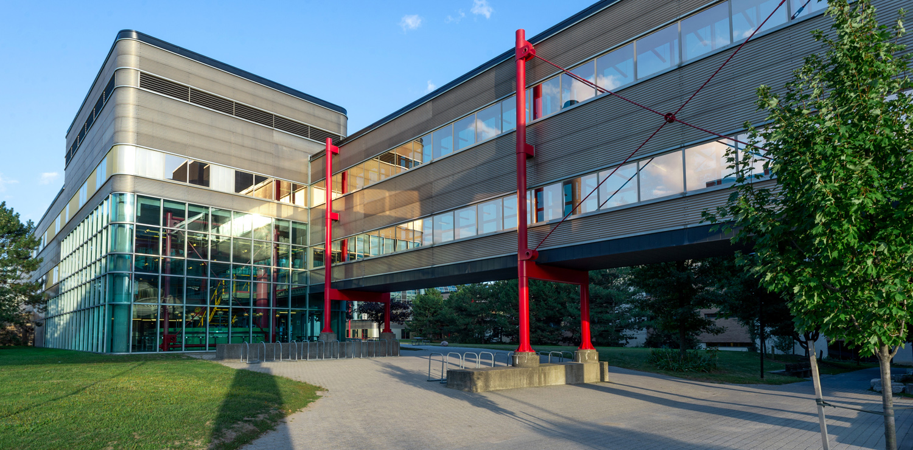
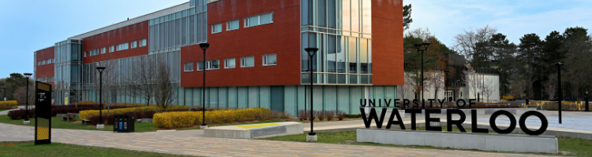

# **Careers in Computer Science | Software Developer** 

#### *Brian Huang*

## **What is a software developer?**
Software developers design, write, and test code for new systems and software to ensure efficiency. They create the foundations for operative systems and run diagnostic programs to certify effectiveness. They are employed in computer software, computer and video game development firms, information technology consulting firms, and in information technology units throughout both private and public sectors. Their salaries can range from around $50,000 to $125,000.

### **Typical Responsibilities**
+ Design, write, read, test, and correct code for new software
+ Analyze information to recommend and plan the installation of new systems or modifications of an existing system
+ Evaluate simple interrelationships between programs such as whether a contemplated change in one part of a program would cause unwanted results in a related part
+ Program animation software to predefined specifications for interactive video games, Internet and mobile applications
+ Write, modify, integrate and test software code for e-commerce, Internet and mobile applications
+ Develop, implement, modify and maintain gameplay features that integrate effectively into existing software
+ Write documentation for new and updated software.

### **Required Skills (technical)**
+ Mathematical aptitude
+ Programming languages (different types of developer roles require different languages)
+ Understanding of the latest trends and role

### **Required Skills (non-technical)**
+ Problem-solving skills
+ Organisational and time management skills
+ Accuracy and attention to detail
+ Communication and leadership skills
+ Analytical and critical thinking skills

## **Education**
Most software developer positions require at least a Bachelor's degree in computer science, software development or similar, but there are other routes to becoming a software developer through demonstrating enthusiasm and the capacity to learn new skills. Employers are sometimes willing to train younger employees.

### **Example University program** 

## ***[Cheriton School of Computer Science] at the [University of Waterloo]***

### **Entrance Requirements (Ontario students)**

+ 5 Grade 12 U and/or M courses:
  + Advanced Functions
  + Calculus and Vectors
  + Any U English
  + One other 4U course
  + Grade 11 U Introduction to Computer Science is *recommended*
+ Admission average of low to mid-90s
+ Waterloo AIF(Admission Information Form)
+ Strongly recommended to participate in:
  + Canadian Computing Competition
  + Canadian Senior Mathematics Contest
  + Euclid Mathematics Contest

### **First-Year Courses**
| September to December|January to April|
| --------------|:--------------|
| CS 135 – Designing Functional Programs       | CS 136 – Elementary Algorithm Design and Data Abstraction|
| MATH 135 – Algebra for Honours Mathematics   | CS 136L – Tools and Techniques for Software Development|
| MATH 137 – Calculus 1 for Honours Mathematics| MATH 136 – Linear Algebra 1 for Honours Mathematics|
| One communication skills course              | MATH 138 – Calculus 2 for Honours Mathematics|
| One elective                                 | Two electives

### **Degree Requirements**
+ 4 - 5 year program with 40 courses or 20 units:
  + 7.75 CS units
  + 3.5 Math units
  + 5.0 Non-Math Elective Units
  + 3.75 Additional Math or Non-Math Elective units
+ Depth Constraints:
  + 1.5 units in the same subject where either at least 0.5 unit is 3xx or higher, or all three form a prerequisite chain
  + 7 regular or 8 co-op terms enrolled in at least three course totalling 1.5 units
  + No more than 2.0 units of failed courses
  + No more than 5.0 units of unusable course attempts(failures and repeats of passed courses)
+ CS major average of 60% or higher
+ Cumulative average of 60% or higher
+ Co-op requirements met, if applicable, including PD 1, PD 11, PD 10, and a minimum of two other PD courses

## **Experiential Learning**
Experiential learning opporunities are a great way to gain unique, hands-on experience in industries outside of the classroom, allowing students to apply their learning in the real world. Many employers look for this experience in their employees.

Some experiential learning opportunities include:
+ Co-op programs
+ Interships
+ Shadowships/Aprenticeships
+ Undergraduate Research
+ Community service
+ Studying abroad
+ Personal projects

At Waterloo, computer science students have access to a variety of co-op, studying abroad and undergraduate research opportunities. 

### **Co-op Program Example**
As a co-op student at Waterloo, students will normally alternate between four months in school and four months as a full-time employee of the organization they are working for.

Alternating school and co-op terms allows students to explore multiple career paths and types of employers to suit their interests, as well as applying what they have learned in school

### **Getting hired**
+ Review job postings from employers Waterloo has recruited and choose which ones students want to apply to.
+ Employers select students to interview, based on résumés, work experience, and perhaps academic record.
+ If you're selected for an interview, you'll meet with the employer in person or online.
+ After the interview, you rank the employers and they rank interviewees based on preference.

### **Sample Co-op Job Titles**
+ Tools and automation engineering intern
+ Data scientist
+ Mobile developer
+ Software developer
+ iOS developer
+ Production engineering
+ Algorithms engineering

## **Real Jobs**

| | Entry Level | Mid Level | Senior Level |
|-|-|-|-|
| **Salary** | $45,000| $75,000 | $124,800 |
| **Industry Average Salary** | $50,440 | $89,440 | $124,800
| **Position** | Programmer software engineer | Software engineer | Software engineer |
| **Company** | Opticut Tech | Andec Mfg. Ltd. | Northern Block Inc |
| **City** | Napanee | Toronto | Toronto
| **Job Description**| We are seeking a Programmer Software Engineer to become an integral part of our team! You will be responsible for creating and modifying computer application software or specialized utility programs.| Responsible for writing machine control and data acquisition software as well as user interface for industrial inspection equipment. Direct communication with customers on-site, by telephone, or email| Collect and document user's requirements and develop logical and physical specifications. Research, evaluate and synthesize technical information to design, develop and test computer-based systems. Develop data, process and network models to optimize architecture and to evaluate the performance and reliability of designs. Plan, design and co-ordinate the development, installation, integration and operation of computer-based systems. Assess, troubleshoot, document, upgrade and develop maintenance procedures for operating systems, communications environments and applications software. Lead and co-ordinate teams of information systems professionals in the development of software and integrated information systems, process control software and other embedded software control systems
| **Additional Skills** | n/a| 3 years of professional experience in writing MS Visual C++, MFC and Windows API applications, good computer skills with MS Word, MS Excel, etc and a desire to travel internationally (typically U.S.A.) for short trips several times per year| 3 - 5 years of experience and specialization in system integration
| **Job Listing** | [Ziprecruiter] | [Indeed] |[Jobbank Canada]|

## **Works Cited**

[University of Waterloo]: https://uwaterloo.ca/
[Cheriton School of Computer Science]: https://cs.uwaterloo.ca/
[Ziprecruiter]: https://www.ziprecruiter.com/c/Opticut-Tech/Job/Programmer-Software-Engineer/-in-Napanee,ON?closed_job_redirect=1&jid=98f4178ad5a002bf
[Indeed]: https://ca.indeed.com/viewjob?jk=42c36958df7a2988&cajb=cajb
[Jobbank Canada]: https://www.jobbank.gc.ca/jobsearch/jobposting/37650903?source=searchresults

